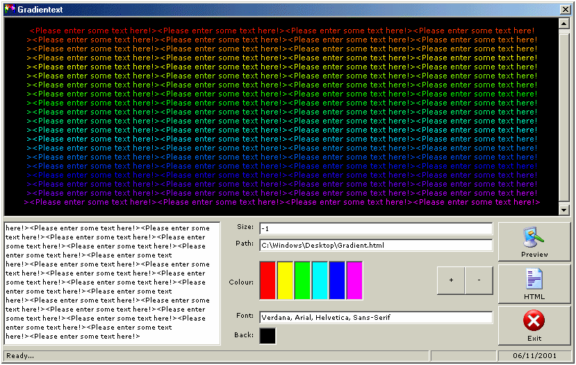



## Gradientext

### Description

Gradientext is a powerful program that creates custom Gradients on HTML text. Up to ten different colours to a gradient!

Check out the screenshot to see what I mean and leave a vote. Thanks
 
### More Info
 

             |
---                |---
**Submitted On**   |2001-11-06 20:26:00
**By**             |[Chris O'Hara](https://github.com/Planet-Source-Code/PSCIndex/blob/master/ByAuthor/chris-o-hara.md)
**Level**          |Intermediate
**User Rating**    |5.0 (10 globes from 2 users)
**Compatibility**  |VB 5\.0, VB 6\.0
**Category**       |[Graphics](https://github.com/Planet-Source-Code/PSCIndex/blob/master/ByCategory/graphics__1-46.md)
**World**          |[Visual Basic](https://github.com/Planet-Source-Code/PSCIndex/blob/master/ByWorld/visual-basic.md)
**Archive File**   |[Gradientex335531162001\.zip](https://github.com/Planet-Source-Code/chris-o-hara-gradientext__1-28687/archive/master.zip)

